# Data Catalogue: Queenstown Liveability Study

This catalogue documents all available datasets from 6 data sources relevant to investigating perceived liveability in Singapore's Queenstown district.

---

## Dataset Relationship Diagram

```mermaid
erDiagram
    PLANNING_AREA_BOUNDARY ||--o{ SUBZONE_BOUNDARY : "contains"
    PLANNING_AREA_BOUNDARY ||--o{ LAND_USE_LAYER : "zones within"
    PLANNING_AREA_BOUNDARY ||--o{ POPULATION_CENSUS : "demographics for"
    PLANNING_AREA_BOUNDARY ||--o{ ONEMAP_POPULATION_API : "demographics for"

    SUBZONE_BOUNDARY ||--o{ HDB_PROPERTY : "located in"
    SUBZONE_BOUNDARY ||--o{ RESALE_FLAT_PRICES : "transactions in"
    SUBZONE_BOUNDARY ||--o{ POPULATION_CENSUS : "demographics for"

    LAND_USE_LAYER ||--o{ BUILDING_HEIGHT_CONTROL : "controls for"
    LAND_USE_LAYER ||--o{ PARK_OPEN_SPACE : "green zones in"
    LAND_USE_LAYER ||--o{ CONSERVATION_AREA : "heritage zones in"
    LAND_USE_LAYER ||--o{ STREET_BLOCK : "built form in"

    BUS_STOPS ||--o{ BUS_ROUTES : "served by"
    BUS_STOPS ||--o{ PASSENGER_VOLUME_BUS : "ridership at"
    TRAIN_STATIONS ||--o{ TRAIN_STATION_EXITS : "exits at"
    TRAIN_STATIONS ||--o{ PASSENGER_VOLUME_TRAIN : "ridership at"
    BUS_STOPS }o--|| ONEMAP_ROUTING : "used in"
    TRAIN_STATIONS }o--|| ONEMAP_ROUTING : "used in"

    FOOTPATH ||--o{ COVERED_LINKWAY : "sheltered by"
    FOOTPATH ||--o{ ROAD_CROSSING : "connects via"
    FOOTPATH ||--o{ PED_OVERHEAD_BRIDGE : "connects via"
    CYCLING_PATH ||--o{ BICYCLE_PARKING : "ends at"
    CYCLING_PATH ||--o{ PARK_CONNECTOR : "links to"

    PARKS ||--o{ PARK_FACILITIES : "contains"
    PARKS ||--o{ PARK_CONNECTOR : "connected by"
    PARK_OPEN_SPACE ||--o{ PARKS : "includes"
    WATERBODY_LAYER ||--o{ ABC_WATERS : "enhanced by"

    MAPILLARY_IMAGERY ||--o{ MAP_FEATURE_POINTS : "detects"
    MAPILLARY_IMAGERY ||--o{ TRAFFIC_SIGNS : "detects"
    MAPILLARY_IMAGERY ||--o{ IMAGE_SEGMENTATION : "segments"
    MAPILLARY_IMAGERY ||--o{ POINT_CLOUD_3D : "reconstructs"

    ONEMAP_THEMES ||--o{ HAWKER_CENTRES : "includes"
    ONEMAP_THEMES ||--o{ COMMUNITY_CLUBS : "includes"
    ONEMAP_THEMES ||--o{ SCHOOLS : "includes"
    ONEMAP_THEMES ||--o{ HEALTHCARE : "includes"
    ONEMAP_THEMES ||--o{ SPORT_FACILITIES : "includes"

    WEATHER_REALTIME }o--|| PLANNING_AREA_BOUNDARY : "nearest station"
    AIR_POLLUTION }o--|| PLANNING_AREA_BOUNDARY : "island-wide"

    PLANNING_AREA_BOUNDARY {
        string PLN_AREA_N "e.g. QUEENSTOWN"
        string PLN_AREA_C
        string REGION_N
        geometry polygon
    }
    SUBZONE_BOUNDARY {
        string SUBZONE_N
        string PLN_AREA_N
        geometry polygon
    }
    BUS_STOPS {
        string bus_stop_code
        float latitude
        float longitude
    }
    TRAIN_STATIONS {
        string station_name
        string station_code
        float latitude
        float longitude
    }
    MAPILLARY_IMAGERY {
        string image_id
        float latitude
        float longitude
        string capture_date
        float compass_angle
    }
```

---

## Summary Table: All Datasets by Source

### Spatial Boundary & Base Layers

| Dataset | Source | Format | Queenstown? | Access |
|---------|--------|--------|-------------|--------|
| Planning Area Boundary | URA / data.gov.sg | GeoJSON | Filter by PLN_AREA_N | Open download |
| Subzone Boundary (15 subzones) | URA / data.gov.sg | GeoJSON | Filter by PLN_AREA_N | Open download |
| Land Use Layer (MP2019) | URA / data.gov.sg | GeoJSON (166 MB) | Spatial clip | Open download |
| Land Use Amendments | URA / data.gov.sg | GeoJSON | Spatial clip | Open download |
| Building Height Control | URA / data.gov.sg | GeoJSON | Spatial clip | Open download |
| Street Block Layer | URA / data.gov.sg | GeoJSON | Spatial clip | Open download |
| Conservation Area Layer | URA / data.gov.sg | GeoJSON | Spatial clip | Open download |
| Urban Design Guideline Layer | URA / data.gov.sg | GeoJSON | Spatial clip | Open download |
| Landed Housing Area Layer | URA / data.gov.sg | GeoJSON | Spatial clip | Open download |
| Development Register Map | URA / data.gov.sg | GeoJSON (85 MB) | Spatial clip | Open download |
| URA Sale Sites | URA / data.gov.sg | GeoJSON | Filter by PLN_AREA_N | Open download |
| Draft Master Plan 2025 Written Statement | URA | PDF | Queenstown sections | Open download |
| DMP25 Website (Central Region) | URA | Interactive web | Queenstown content | Free viewing |

### Social Intensity

| Dataset | Source | Format | Queenstown? | Access |
|---------|--------|--------|-------------|--------|
| Hawker Centres | data.gov.sg | GeoJSON | Spatial filter | Open download |
| Supermarkets | data.gov.sg | GeoJSON | Spatial filter | Open download |
| HDB Property Information | data.gov.sg | CSV | Filter by town | Open download |
| Resale Flat Prices | data.gov.sg | CSV + API | Filter by town | Open download |
| OneMap Themes (110+ POI layers) | OneMap | JSON API | Bounding box filter | Free API token |
| Private Property Transactions | URA API | JSON | By district | Free API key |
| Passenger Volume (Bus) | LTA DataMall | JSON API | By bus stop code | Free API key |
| Passenger Volume (Train) | LTA DataMall | JSON API | By station | Free API key |
| Population Census 2020 | data.gov.sg | CSV | By planning area | Open download |
| OneMap Population API (22 datasets) | OneMap | JSON API | By planning area | Free API token |

### Accessibility

| Dataset | Source | Format | Queenstown? | Access |
|---------|--------|--------|-------------|--------|
| Bus Stops | LTA DataMall | Shapefile + API | Spatial clip | Open / API key |
| Bus Routes | LTA DataMall | JSON API | Filter by stops | Free API key |
| Bus Services (frequency) | LTA DataMall | JSON API | Filter by stops | Free API key |
| Train Stations | LTA DataMall | Shapefile | Spatial clip | Open download |
| Train Station Exits | LTA DataMall / data.gov.sg | Shapefile / GeoJSON | Spatial clip | Open download |
| OD Passenger Volume (Bus) | LTA DataMall | JSON API | By stop pairs | Free API key |
| OD Passenger Volume (Train) | LTA DataMall | JSON API | By station pairs | Free API key |
| OneMap Routing (drive/walk/cycle/PT) | OneMap | JSON API | Any coordinates | Free API token |
| Road Section Line | LTA DataMall | Shapefile | Spatial clip | Open download |
| Traffic Count | LTA DataMall | Geodatabase (518 MB) | Spatial clip | Open download |
| Pedestrian Facilities | data.gov.sg | GeoJSON | Spatial clip | Open download |
| Park Connector Loop | data.gov.sg | GeoJSON | Spatial clip | Open download |
| ABC Waters Sites | data.gov.sg | GeoJSON | Spatial clip | Open download |
| Park & Open Space Layer | URA / data.gov.sg | GeoJSON | Spatial clip | Open download |
| Waterbody Layer | URA / data.gov.sg | GeoJSON | Spatial clip | Open download |
| Car Park Availability | URA API | JSON | By location | Free API key |
| Taxi Stands | LTA DataMall | Shapefile | Spatial clip | Open download |

### Active Mobility

| Dataset | Source | Format | Queenstown? | Access |
|---------|--------|--------|-------------|--------|
| Cycling Path Network | LTA / data.gov.sg | Shapefile / GeoJSON | Spatial clip | Open download |
| SDCP Planned Cycling Paths | data.gov.sg | GeoJSON | Spatial clip | Open download |
| Bicycle Parking | LTA DataMall | JSON API | By radius query | Free API key |
| Footpath | LTA DataMall | Shapefile (7.1 MB) | Spatial clip | Open download |
| Covered Linkway | LTA DataMall | Shapefile | Spatial clip | Open download |
| Pedestrian Overhead Bridge/Underpass | LTA DataMall | Shapefile | Spatial clip | Open download |
| Road Crossing | LTA DataMall | Shapefile | Spatial clip | Open download |
| Silver Zone | LTA DataMall | Shapefile | Spatial clip | Open download |
| NParks Tracks | data.gov.sg | GeoJSON | Spatial clip | Open download |
| Mapillary Street-Level Imagery | Mapillary | JPEG + JSON | Variable density | Free API token |
| Mapillary Traffic Signs | Mapillary | GeoJSON | Where images exist | Free API token |

### Microclimate

| Dataset | Source | Format | Queenstown? | Access |
|---------|--------|--------|-------------|--------|
| Realtime Weather Readings | data.gov.sg | JSON API | Nearest station | Open API |
| Monthly Climate Data (1984+) | data.gov.sg | CSV | Single station (Changi) | Open download |
| Historical Daily Weather (2009-2017) | data.gov.sg | CSV / API | Station-level | Open download |
| Air Pollution Levels (Annual) | data.gov.sg | CSV | Island-wide aggregate | Open download |
| Mapillary Image Segmentation (GVI) | Mapillary | JSON per-image | Where images exist | Free API token |
| Mapillary 3D Point Clouds | Mapillary | JSON (zlib) | Partial coverage | Free API token |

### Public Facilities

| Dataset | Source | Format | Queenstown? | Access |
|---------|--------|--------|-------------|--------|
| Parks | data.gov.sg | GeoJSON | Spatial filter | Open download |
| Park Facilities | data.gov.sg | GeoJSON | Spatial filter | Open download |
| Community Clubs | data.gov.sg | GeoJSON | Spatial filter | Open download |
| Sport Facilities (SportSG) | data.gov.sg | GeoJSON | Spatial filter | Open download |
| Gyms@SG | data.gov.sg | GeoJSON | Spatial filter | Open download |
| Schools | data.gov.sg | CSV | Needs geocoding | Open download |
| Pre-Schools | data.gov.sg | GeoJSON | Spatial filter | Open download |
| CHAS Clinics | data.gov.sg | GeoJSON | Spatial filter | Open download |
| Eldercare Services | data.gov.sg | CSV / GeoJSON | Spatial filter | Open download |
| Health Facilities | data.gov.sg | GeoJSON | Spatial filter | Open download |
| Mapillary Map Feature Points | Mapillary | GeoJSON | Where images exist | Free API token |
| Lamp Posts / Street Lighting | LTA DataMall | Shapefile | Spatial clip | Open download |
| EV Charging Points | LTA DataMall | CSV / API | Spatial filter | Open / API key |

---

## Detailed Catalogue by Source

---

## 1. data.gov.sg

Singapore's open data portal. All datasets are openly downloadable under the Open Data Licence. Most geospatial data is in GeoJSON format.

### Base Layers
| # | Dataset | Format | Key Fields |
|---|---------|--------|------------|
| 1 | [Master Plan 2019 Subzone Boundary](https://data.gov.sg/datasets/d_8594ae9ff96d0c708bc2af633048edfb/view) | GeoJSON | SUBZONE_N, PLN_AREA_N, CA_IND |
| 2 | [Master Plan 2019 Land Use Layer](https://data.gov.sg/datasets/d_90d86daa5bfaa371668b84fa5f19e2d68/view) | GeoJSON (13.7 MB) | LU_DESC, GPR |

### Social Intensity
| # | Dataset | Format | Notes |
|---|---------|--------|-------|
| 3 | [Hawker Centres](https://data.gov.sg/datasets/d_4a086da0a5553be1d89383cd90d07ecd/view) | GeoJSON | Name, address, stall count |
| 4 | [Supermarkets](https://data.gov.sg/datasets/d_cac2c32f01960a3ad7202a99c27268a0/view) | GeoJSON | Business name, address |
| 5 | [HDB Property Information](https://data.gov.sg/datasets/d_17f5382f26140b1fdae0ba2ef6239d2f/view) | CSV | Year, type, flats count; needs geocoding |
| 6 | [Resale Flat Prices](https://data.gov.sg/collections/189/view) | CSV + API | Price, area, lease; filter by town=QUEENSTOWN |

### Accessibility
| # | Dataset | Format | Notes |
|---|---------|--------|-------|
| 7 | [MRT Station Exits](https://data.gov.sg/datasets/d_b39d3a0871985372d7e1637193335da5/view) | GeoJSON | Station name, exit code |
| 8 | [Pedestrian Facilities](https://data.gov.sg/datasets/d_45175a1ff466b44414a9a1aeef564e6f/view) | GeoJSON | Bridges, underpasses, linkways |
| 9 | [Park Connector Loop](https://data.gov.sg/datasets/d_a69ef89737379f231d2ae93fd1c5707f/view) | GeoJSON | Indicative alignment |
| 10 | [ABC Waters Completed](https://data.gov.sg/datasets/d_b5f239cc954bb7920245a7b8ad95dde8/view) | GeoJSON | Blue-green infrastructure |

### Active Mobility
| # | Dataset | Format | Notes |
|---|---------|--------|-------|
| 11 | [Cycling Path Network](https://data.gov.sg/datasets/d_8f468b25193f64be8a16fa7d8f60f553/view) | GeoJSON | Symbolic/indicative |
| 12 | [SDCP Planned Cycling Paths](https://data.gov.sg/datasets/d_4d1c99c6bb6f002ee566b8f55ffb0d58/view) | GeoJSON | Planned vs existing |
| 13 | [NParks Tracks](https://data.gov.sg/datasets/d_306cc1018cb733346681883ee6d73054/view) | GeoJSON | Walking trails in parks |

### Microclimate
| # | Dataset | Format | Notes |
|---|---------|--------|-------|
| 14 | [Realtime Weather Readings](https://data.gov.sg/collections/1459/view) | JSON API | Temperature, humidity, rain, wind |
| 15 | [Monthly Climate Data](https://data.gov.sg/datasets/d_1744ca68dc7ed37221b17c441042405e/view) | CSV | From 1984; single station |
| 16 | [Historical Daily Weather](https://data.gov.sg/datasets/d_03bb2eb67ad645d0188342fa74ad7066/view) | CSV | 2009-2017 |
| 17 | [Air Pollution Levels](https://data.gov.sg/datasets/d_8f5fa022cbda68494fa70e788600505b/view) | CSV | Annual aggregate |

### Public Facilities
| # | Dataset | Format | Notes |
|---|---------|--------|-------|
| 18 | [Parks](https://data.gov.sg/dataset/parks) | GeoJSON | NParks-managed |
| 19 | [Park Facilities](https://data.gov.sg/datasets/d_14d807e20158338fd578c2913953516e/view) | GeoJSON | Playgrounds, fitness, BBQ |
| 20 | [Community Clubs](https://data.gov.sg/dataset/community-clubs) | GeoJSON | CC locations |
| 21 | [Sport Facilities](https://data.gov.sg/datasets/d_9b87bab59d036a60fad2a91530e10773/view) | GeoJSON | SportSG venues |
| 22 | [Gyms@SG](https://data.gov.sg/datasets/d_b3ae090692ecf632116c9885cfbd3424/view) | GeoJSON | Public exercise facilities |
| 23 | [Schools](https://data.gov.sg/datasets/d_688b934f82c1059ed0a6993d2a829089/view) | CSV | Needs geocoding |
| 24 | [Pre-Schools](https://data.gov.sg/datasets/d_61eefab99958fd70e6aab17320a71f1c/view) | GeoJSON | Childcare + kindergartens |
| 25 | [CHAS Clinics](https://data.gov.sg/datasets/d_548c33ea2d99e29ec63a7cc9edcccedc/view) | GeoJSON | 1,300+ GP clinics |
| 26 | [Eldercare Services](https://data.gov.sg/collections/714/view) | CSV / GeoJSON | MOH directory |
| 27 | [Health Facilities](https://data.gov.sg/datasets/d_e4663ad3f088a46dabd3972dc166402d/view) | GeoJSON | Primary care, dental, pharmacies |
| 28 | [Population by Planning Area (Census 2020)](https://data.gov.sg/datasets/d_d95ae740c0f8961a0b10435836660ce0/view) | CSV | Age, sex by subzone |

---

## 2. URA Maps / Master Plan

URA SPACE interactive map and Master Plan datasets. Downloadable layers available via data.gov.sg; APIs require free registration.

### Downloadable GeoJSON Layers (via data.gov.sg)
| # | Dataset | Size | Key Use |
|---|---------|------|---------|
| 1 | [Land Use Layer (MP2019)](https://data.gov.sg/datasets/d_90d86daa5bfaa371668b84fa5f01424f/view) | 166 MB | Zoning categories |
| 2 | [Land Use Amendments](https://data.gov.sg/collections/2107/view) | -- | Gazetted changes since 2019 |
| 3 | [Planning Area Boundary](https://data.gov.sg/collections/2104/view) | 2 MB | Queenstown boundary |
| 4 | [Subzone Boundary](https://data.gov.sg/datasets/d_8594ae9ff96d0c708bc2af633048edfb/view) | 3 MB | 15 Queenstown subzones |
| 5 | [Building Height Control](https://data.gov.sg/datasets/d_ee8e2e0d13a50a699f9100029b8c0b0a/view) | 2.7 MB | Height limits |
| 6 | [Park & Open Space](https://data.gov.sg/collections/1650/view) | -- | Green network |
| 7 | [Waterbody Layer](https://data.gov.sg/datasets/d_0b0792ae30cd6cce62e5ea55fc37860e/view) | 5.3 MB | Blue network |
| 8 | [Street Block Layer](https://data.gov.sg/datasets/d_07b3e42fba1ec69cd6044bedd3545ccb/view) | -- | Built form |
| 9 | [Conservation Area](https://data.gov.sg/collections/1725/view) | ~943 KB | Heritage zones |
| 10 | [Landed Housing Area](https://data.gov.sg/datasets/d_cef89e55a52d87e433d7460aa4236e18/view) | -- | Housing typology |
| 11 | [Symbol Text (GPR annotations)](https://data.gov.sg/datasets/d_dc4918b82cb79cbb706c8f35bc412242/view) | 13.7 MB | Density indicators |
| 12 | [Development Register Map](https://data.gov.sg/datasets/d_5fea232c6e60ea4a896e355e3c05141c/view) | 85 MB | Development sites |

### URA Data Service APIs
Require free registration at https://eservice.ura.gov.sg/maps/api/

| # | API | Update Freq | Use |
|---|-----|------------|-----|
| 1 | Car Park Availability | Every 3-5 min | Real-time parking |
| 2 | Car Park Details & Rates | Daily | Parking info |
| 3 | Property Transactions (Private) | Tue & Fri | Housing market |
| 4 | Median Rentals | Quarterly | Rental market |
| 5 | Planning Decisions | Daily | Development approvals |

### Draft Master Plan 2025
| # | Resource | Format | Notes |
|---|----------|--------|-------|
| 1 | [DMP25 Written Statement](https://www.ura.gov.sg/-/media/Corporate/Planning/Master-Plan/DMP25writtenstatement.pdf) | PDF | Statutory document |
| 2 | [DMP25 Central Region](https://www.uradraftmasterplan.gov.sg/regional-plans/central-region/introduction/) | Web | Queenstown content |
| 3 | [URA SPACE Map](https://eservice.ura.gov.sg/maps/?service=mp) | Interactive | View-only |

**Queenstown-specific DMP25 highlights:** Queensway Node (community space under flyover, 2027), Rail Corridor enhancements, Alexandra-Queensway Park Connector, PLH BTO launches, Community Care Apartments, 5,000+ new flats since 2021.

---

## 3. OneMap

Singapore's national map platform by SLA. All APIs require a free token (register then POST to `/api/auth/post/getToken`).

**API Base:** `https://www.onemap.gov.sg/api`
**Docs:** https://www.onemap.gov.sg/apidocs/

| # | API | Format | Key Use | Queenstown? |
|---|-----|--------|---------|-------------|
| 1 | [Planning Area Boundaries](https://www.onemap.gov.sg/apidocs/planningarea) | GeoJSON | Study area polygon | Direct query by name |
| 2 | [Population Query (22 datasets)](https://www.onemap.gov.sg/apidocs/populationquery) | JSON | Demographics (age, ethnicity, income, transport mode, dwelling type) | By planning area |
| 3 | [Themes (110+ layers)](https://www.onemap.gov.sg/apidocs/themes) | JSON | POIs: schools, hawkers, parks, healthcare, community clubs, heritage, transport | Bounding box filter |
| 4 | [Routing (drive/walk/cycle/PT)](https://www.onemap.gov.sg/apidocs/routing) | JSON | Travel time, distance, route geometry | Any coordinates |
| 5 | Search / Geocoding | JSON | Address to coordinates | Any address |
| 6 | Coordinate Conversion | JSON | WGS84 / SVY21 / Web Mercator | Any point |
| 7 | Static Map Images | PNG | Programmatic map generation | Any extent |
| 8 | [Population Dashboard](https://popquery.onemap.gov.sg/) | Web viz | Interactive demographics explorer | Direct selection |

**Note:** Population data available for census years 2000, 2010, 2015, 2020 only. Themes list must be retrieved dynamically via `getAllThemesInfo`.

---

## 4. LTA DataMall

Land Transport Authority data portal. Static shapefiles are openly downloadable; dynamic APIs require a free API key.

**Registration:** https://datamall.lta.gov.sg/content/datamall/en/request-for-api.html
**Bulk geospatial download:** 623 MB ZIP with all shapefile layers.

### Transit Network
| # | Dataset | Format | Access | Notes |
|---|---------|--------|--------|-------|
| 1 | Bus Stops | Shapefile + API | Open / API key | Location + bus stop code |
| 2 | Bus Routes | JSON API | API key | Stop sequences, first/last bus |
| 3 | Bus Services | JSON API | API key | Dispatch frequency |
| 4 | Train Stations | Shapefile | Open | Queenstown: EW Line + Circle Line |
| 5 | Train Station Exits | Shapefile | Open | Last-mile connectivity |

### Ridership
| # | Dataset | Format | Access | Update |
|---|---------|--------|--------|--------|
| 6 | Passenger Volume (Bus Stops) | JSON API | API key | Monthly |
| 7 | Passenger Volume (Train Stations) | JSON API | API key | Monthly |
| 8 | OD Volume (Bus) | JSON API | API key | Monthly |
| 9 | OD Volume (Train) | JSON API | API key | Monthly |

### Active Mobility
| # | Dataset | Format | Access | Notes |
|---|---------|--------|--------|-------|
| 10 | Cycling Path | Shapefile | Open | Intra-town; excludes park connectors |
| 11 | Bicycle Parking | JSON API | API key | Radius query |
| 12 | Footpath | Shapefile (7.1 MB) | Open | Comprehensive pedestrian network |
| 13 | Covered Linkway | Shapefile | Open | Sheltered walking (important in tropical SG) |
| 14 | Pedestrian Overhead Bridge/Underpass | Shapefile | Open | Grade-separated crossings |
| 15 | Road Crossing | Shapefile | Open | At-grade pedestrian crossings |
| 16 | Silver Zone | Shapefile | Open | Elderly pedestrian safety areas |

### Road Network
| # | Dataset | Format | Access | Notes |
|---|---------|--------|--------|-------|
| 17 | Road Section Line | Shapefile | Open | Road name, code |
| 18 | Traffic Count | Geodatabase (518 MB) | Open | 15-min intervals at junctions |
| 19 | Traffic Speed Bands | JSON API | API key | Real-time |

### Other Infrastructure
| # | Dataset | Format | Access |
|---|---------|--------|--------|
| 20 | Taxi Stands | Shapefile | Open |
| 21 | Lamp Posts | Shapefile | Open |
| 22 | EV Charging Points | CSV + API | Open / API key |
| 23 | Carpark Availability | JSON API | API key |

### On-Request (NDA Required)
| # | Dataset | Notes |
|---|---------|-------|
| 24 | Farecard Transactions | Anonymized entry/exit records |
| 25 | Taxi/PHC Trip Data | Pickup/dropoff with timestamps |

---

## 5. Mapillary

Crowdsourced street-level imagery platform (owned by Meta). Images are CC BY-SA 4.0. All API access requires a free client token.

**API:** `https://graph.mapillary.com` | **Tiles:** `https://tiles.mapillary.com`
**Python SDK:** `pip install mapillary`
**Companion tool:** [ZenSVI](https://github.com/koito19960406/ZenSVI) (NUS Urban Analytics Lab) — end-to-end pipeline for downloading, CV analysis, and Green View Index computation.

| # | Dataset | Format | Use | Limitations |
|---|---------|--------|-----|-------------|
| 1 | Street-Level Imagery | JPEG + JSON | Pedestrian-perspective visual audit | Coverage varies by street |
| 2 | Map Feature Points (42 categories) | GeoJSON / Vector tiles | Benches, bike racks, bollards, crosswalks, lamps, trash cans | Needs 3+ images for detection |
| 3 | Traffic Sign Detections (~1,500 classes) | GeoJSON / Vector tiles | Wayfinding, cycling/pedestrian signage | Needs 2+ images |
| 4 | Image Segmentation & Detections | JSON per-image | Green View Index (GVI/PGVI), surface analysis | Processing-intensive |
| 5 | 3D Point Clouds (SfM) | JSON (zlib) | Street geometry, canopy estimation | Needs dense image sequences |
| 6 | Vistas Dataset (25K images, 124 categories) | Images + masks (21 GB) | Train custom CV models | CC BY-NC-SA; not SG-specific |
| 7 | Traffic Sign Dataset (100K images) | Images + bboxes | Train sign detectors | Research only; not SG-specific |

**Rate limits:** 60,000 entity requests/min, 50,000 tile requests/day. Bounding box queries max ~1.1 km square.

---

## 6. URA Draft Master Plan 2025

The latest planning framework for Singapore, gazetted in late 2025.

| # | Resource | Format | Access |
|---|----------|--------|--------|
| 1 | [DMP25 Written Statement](https://www.ura.gov.sg/-/media/Corporate/Planning/Master-Plan/DMP25writtenstatement.pdf) | PDF | Open |
| 2 | [Central Region Plans](https://www.uradraftmasterplan.gov.sg/regional-plans/central-region/introduction/) | Web | Free |
| 3 | [Liveable Neighbourhoods Theme](https://www.uradraftmasterplan.gov.sg/themes/shaping-a-happy-healthy-city/liveable-and-inclusive-neighbourhoods/) | Web | Free |
| 4 | [City in Nature Theme](https://www.uradraftmasterplan.gov.sg/themes/stewarding-nature-and-heritage/a-city-in-nature/) | Web | Free |
| 5 | [Rail Corridor](https://www.uradraftmasterplan.gov.sg/themes/stewarding-nature-and-heritage/identity-corridors/rail-corridor/) | Web | Free |

**Note:** No downloadable GeoJSON for DMP25 yet. MP2019 datasets on data.gov.sg remain the latest machine-readable versions.

---

## Access Requirements Summary

| Access Level | Sources | What You Need |
|---|---|---|
| **Open download** | data.gov.sg, LTA static shapefiles | Nothing — direct download |
| **Free API token** | OneMap, LTA DataMall, Mapillary | Register online, get token/key |
| **Free API key** | URA Data Service | Register at URA SPACE |
| **NDA required** | LTA farecard/taxi trip data | Data sharing form + NDA |
| **View-only** | URA SPACE map, DMP25 website, Population Dashboard | Browser |

---

## Key Spatial Join Fields

Datasets can be linked through these common fields:

| Join Type | Field | Datasets Connected |
|---|---|---|
| **Planning area name** | `PLN_AREA_N = "QUEENSTOWN"` | Boundaries, census, OneMap population, URA sale sites |
| **Subzone name** | `SUBZONE_N` | Boundaries, census (finer granularity) |
| **Lat/Lng coordinates** | WGS84 (EPSG:4326) | All point datasets, Mapillary imagery, OneMap routing |
| **SVY21 coordinates** | EPSG:3414 | URA APIs, some LTA data (use OneMap converter) |
| **Bus stop code** | `bus_stop_code` | LTA bus stops, routes, passenger volumes |
| **Station name/code** | `station_name` | LTA train stations, exits, passenger volumes |
| **Spatial clip/intersect** | Polygon boundary | All geospatial layers clipped to Queenstown boundary |
| **Address / postal code** | Text matching | HDB data, schools, OneMap geocoding |

---

## Gaps & Limitations

- **No noise pollution data** — would require primary data collection
- **No pedestrian foot traffic counts** — could estimate via Mapillary or field observation
- **No sentiment/perception data** — requires primary research (surveys, interviews)
- **Microclimate data is coarse** — weather stations don't capture Queenstown-specific microclimates; Mapillary GVI can supplement for greenery assessment
- **DMP25 not yet in machine-readable format** — must rely on MP2019 GeoJSON + DMP25 PDF/web for latest plans
- **Some CSV datasets need geocoding** — HDB Property Info, Schools (use OneMap Search API)
